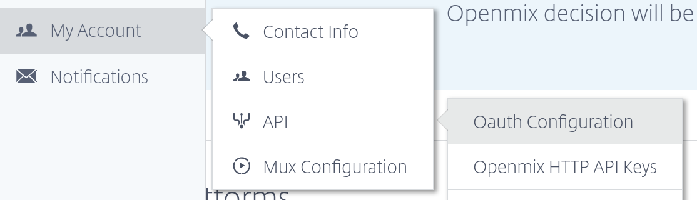

# Terraform Provider

- Website: https://www.terraform.io
- [](https://gitter.im/hashicorp-terraform/Lobby)
- Mailing list: [Google Groups](http://groups.google.com/group/terraform-tool)


## Maintainers

This project is maintained by the developers at [Cedexis](https://www.cedexis.com/) (now part of Citrix&#174;).

## Table Of Contents
- [Requirements](#requirements)
- [Building The Provider](#building-the-provider)
- [OSX Setup With HomeBrew](#osx-setup-with-homebrew)
- [Using The Provider](#using-the-provider)
- [Where To Go Next](#where-to-go-next)
- [Contributing](#contributing)

## Requirements

- [Terraform](https://www.terraform.io/downloads.html) 0.11+
- [Go](https://golang.org/doc/install) 1.11+ (to build the provider plugin)
- A Citrix ITM account with API access (see below)

## Building The Provider

To build the provider, make sure you have a working Go installation.

For the sake of simplicity, we'll assume that your `GOPATH` environment variable is set to include `$HOME/go`. Otherwise, you'll need to adapt the instructions below so that the `terraform-provider-citrixitm` repo goes in a suitable location.

Clone the `terraform-provider-citrixitm` repo:

```bash
$ mkdir -p $GOPATH/src/github.com/cedexis
$ cd $GOPATH/src/github.com/cedexis
$ git clone git@github.com:cedexis/terraform-provider-citrixitm.git
```

Enter the project root directory and build the provider by running `make build`.

Example:

```bash
$ cd $GOPATH/src/github.com/cedexis/terraform-provider-citrixitm
$ make build
```

The `build` target does a couple of things. First it executes `scripts/gofmtcheck.sh`, which makes sure that all of the code files in the repository conform to Go formatting standards. Assuming the formatting check passes, it then executes `go install`, which builds the plugin binary and places it within `$GOPATH/bin`.

### OSX Setup With HomeBrew
This section assumes you already have [HomeBrew](https://brew.sh/) installed.

```bash
brew install golang
mkdir -p $GOPATH/src/github.com/cedexis
git clone git@github.com:cedexis/terraform-provider-citrixitm.git \
  $GOPATH/src/github.com/cedexis/terraform-provider-citrixitm
cd $GOPATH/src/github.com/cedexis/terraform-provider-citrixitm
make build
```
You should now be ready to start using the provider.

## Using The Provider

Using the provider requires a Citrix ITM account with access to the API. You can sign up by visiting the [Citrix ITM Portal](https://portal.cedexis.com).

To find out if your account has access to the API, navigate to `My Account > API > Oauth Configuration`. If you don't see these options then you'll need to send an email to [Cedexis Support](mailto:support@cedexis.comi) and request API access.



### Installation

The Citrix ITM provider is a third party plugin and must be installed manually. This is simply a matter of taking the executable that you built in the previous section and copying it into the `$HOME/.terraform.d/plugins` directory.

Example:

```bash
$ mkdir -p $HOME/.terraform.d/plugins
$ cp $GOPATH/bin/terraform-provider-citrixitm $HOME/.terraform.d/plugins/
```

The Citrix ITM provider is now available for use in any Terraform configurations referencing it.

## Where To Go Next

Why not head over to the [Custom App From File](examples/dns/custom-app-from-file) example and give it a try?

## Contributing

Contributions are welcome. Please see [Contributing](./CONTRIBUTING.md).
