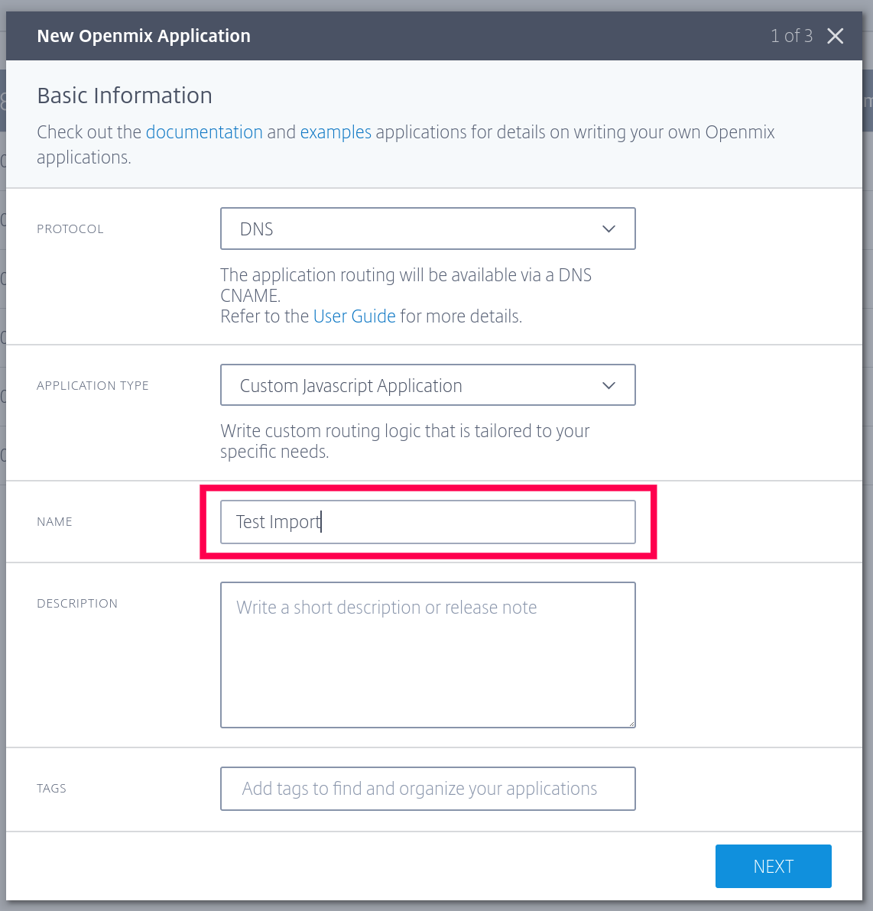
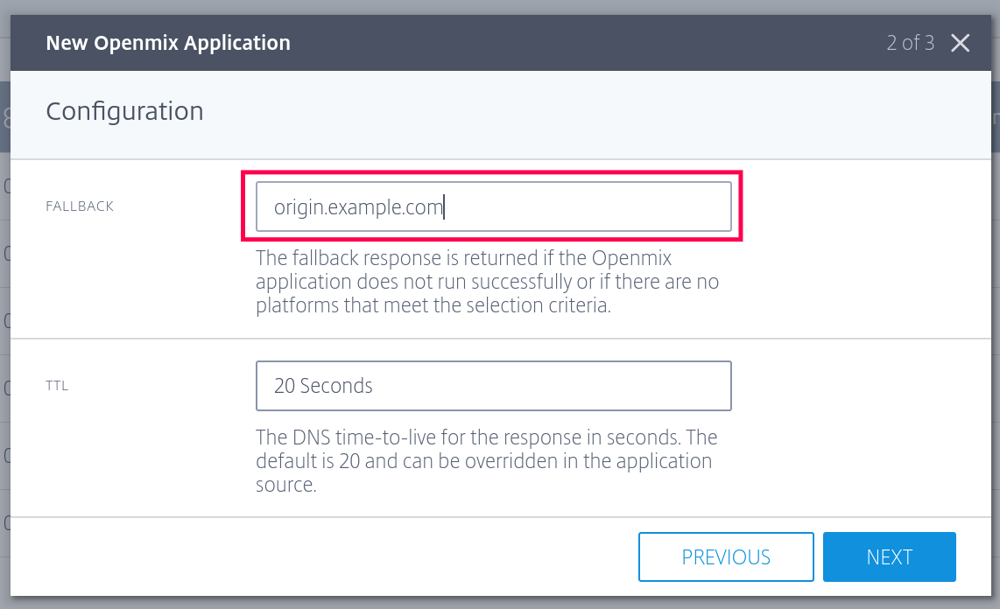
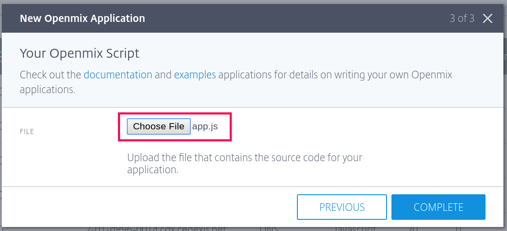
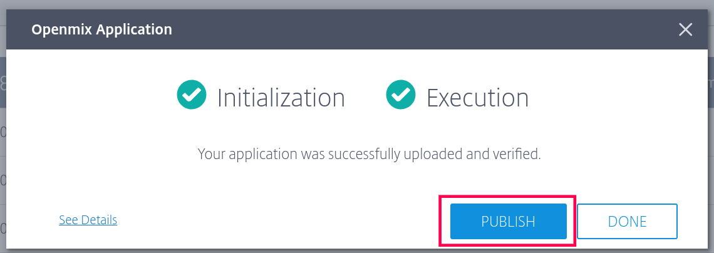
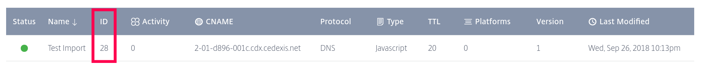

# Import Custom App

In this example we use `terraform import` to allow an existing custom DNS routing app to be managed by Terraform. Read more about the Terraform import feature [here](https://www.terraform.io/docs/import/index.html).

## Example Files

The example module includes the following files:

| Filename       | Description |
| ---            | --- |
| README.md      | The file you're reading now. |
| main.tf        | The main Terraform config file for this module. |
| vars.tf        | A file specifying input variables that must be set when you run Terraform commands against this module. |
| outputs.tf     | A file specifying output variables that will be set automatically when you run Terraform commands that update infrastructure. |
| app.js | A JavaScript file containing a sample custom Citrix ITM DNS routing application. |


## Running the Example

As you go through this example, you'll be asked to run various Terraform commands, and the instructions often remind you to execute the command from within the example module directory. This simply means that you should be in the directory containing the example's \*.tf files when executing the command. Terraform acts on files starting from the current working directory, which it considers to be the "root" module.

### Authenticating

Like all of the examples in this repository, you'll need a client ID and secret pair, which can be generated on the Cedexis Portal [OAuth configuration](https://portal.cedexis.com/ui/api/oauth) page.

For convenience we assume that you have two environment variables set to these.

Example:

```
CITRIXITM_CLIENT_ID=<your client ID>
CITRIXITM_CLIENT_SECRET=<your client secret>
```

These environment variables are used in place of the client ID and secret in the commands that follow.

## Setup the App Using Citrix ITM Portal

Before we can import the app, it must first be created using the Citrix ITM Portal UI. Go to the [Openmix applications page](https://portal.cedexis.com/ui/openmix/applications) now and create a new application.

Name the app "Test Import". This differs from the name "My Static App" that is specified in the Terraform resource configuration. That is so we can demonstrate how Terraform will reconcile the difference later.  



Set the app fallback CNAME. The resource configuration specifies "origin.example.com", so if you set it to anything else, Terraform will reconcile the difference by changing production to match the configuration later.



Choose the application file by clicking on the _Choose File_ button and navigating to the app.js file found in this example.



Click Publish.



Take note of the application ID.



### Import the DNS Routing App

The first step is to initialize the module. From within the example module directory, run `terraform init`:

Example:

```bash
$ terraform init

Initializing provider plugins...

Terraform has been successfully initialized!

You may now begin working with Terraform. Try running "terraform plan" to see
any changes that are required for your infrastructure. All Terraform commands
should now work.

If you ever set or change modules or backend configuration for Terraform,
rerun this command to reinitialize your working directory. If you forget, other
commands will detect it and remind you to do so if necessary.
```

Run `terraform import -var itm_client_id=$CITRIXITM_CLIENT_ID -var itm_client_secret=$CITRIXITM_CLIENT_SECRET citrixitm_dns_app.dns_simple <app_id>`, replacing `<app_id>` with the application ID you noted earlier.

Example:

```bash
$ terraform import -var itm_client_id=$CITRIXITM_CLIENT_ID -var itm_client_secret=$CITRIXITM_CLIENT_SECRET citrixitm_dns_app.simple_app 28
citrixitm_dns_app.simple_app: Importing from ID "28"...
citrixitm_dns_app.simple_app: Import complete!
  Imported citrixitm_dns_app (ID: 28)
citrixitm_dns_app.simple_app: Refreshing state... (ID: 28)

Import successful!

The resources that were imported are shown above. These resources are now in
your Terraform state and will henceforth be managed by Terraform.
```

To view the Terraform state that has been imported, run `terraform state show citrixitm_dns_app.simple_app`.

Example:

```bash
$ terraform state show citrixitm_dns_app.simple_app
id             = 28
app_data       = function init(config) {}

function onRequest(request, response) {
    response.addCName('foo.example.com');
    response.setTTL(20);
}
cname          = 2-01-d896-001c.cdx.cedexis.net
description    =
fallback_cname = origin.example.com
fallback_ttl   = 20
name           = Test Import
version        = 1
```

To see what differences exist between the imported state and the resource configuration, run `terraform plan -var itm_client_id=$CITRIXITM_CLIENT_ID -var itm_client_secret=$CITRIXITM_CLIENT_SECRET`.

Example:

```bash
$ terraform plan -var itm_client_id=$CITRIXITM_CLIENT_ID -var itm_client_secret=$CITRIXITM_CLIENT_SECRET
Refreshing Terraform state in-memory prior to plan...
The refreshed state will be used to calculate this plan, but will not be
persisted to local or remote state storage.

citrixitm_dns_app.simple_app: Refreshing state... (ID: 28)

------------------------------------------------------------------------

An execution plan has been generated and is shown below.
Resource actions are indicated with the following symbols:
  ~ update in-place

Terraform will perform the following actions:

  ~ citrixitm_dns_app.simple_app
      description: "" => "A simple static response app"
      name:        "Test Import" => "My Static App"


Plan: 0 to add, 1 to change, 0 to destroy.

------------------------------------------------------------------------

Note: You didn't specify an "-out" parameter to save this plan, so Terraform
can't guarantee that exactly these actions will be performed if
"terraform apply" is subsequently run.
```

In the example output above, Terraform observes that there is a difference between the app name and description that we entered in the Portal and those listed in the resource configuration.

To reconcile these differences, update the production app from the resource configuration by running `terraform apply -var itm_client_id=$CITRIXITM_CLIENT_ID -var itm_client_secret=$CITRIXITM_CLIENT_SECRET`.

Example:

```bash
$ terraform apply -var itm_client_id=$CITRIXITM_CLIENT_ID -var itm_client_secret=$CITRIXITM_CLIENT_SECRET
citrixitm_dns_app.simple_app: Refreshing state... (ID: 28)

An execution plan has been generated and is shown below.
Resource actions are indicated with the following symbols:
  ~ update in-place

Terraform will perform the following actions:

  ~ citrixitm_dns_app.simple_app
      description: "" => "A simple static response app"
      name:        "Test Import" => "My Static App"


Plan: 0 to add, 1 to change, 0 to destroy.

Do you want to perform these actions?
  Terraform will perform the actions described above.
  Only 'yes' will be accepted to approve.

  Enter a value: yes

citrixitm_dns_app.simple_app: Modifying... (ID: 28)
  description: "" => "A simple static response app"
  name:        "Test Import" => "My Static App"
citrixitm_dns_app.simple_app: Modifications complete after 0s (ID: 28)

Apply complete! Resources: 0 added, 1 changed, 0 destroyed.

Outputs:

dns_app_cname = 2-01-d896-001c.cdx.cedexis.net
dns_app_id = 28
dns_app_version = 2
```

Now run `terraform plan -var itm_client_id=$CITRIXITM_CLIENT_ID -var itm_client_secret=$CITRIXITM_CLIENT_SECRET` again to see that the production app and resource configuration are in sync.

Example:

```bash
$ terraform plan -var itm_client_id=$CITRIXITM_CLIENT_ID -var itm_client_secret=$CITRIXITM_CLIENT_SECRET
Refreshing Terraform state in-memory prior to plan...
The refreshed state will be used to calculate this plan, but will not be
persisted to local or remote state storage.

citrixitm_dns_app.simple_app: Refreshing state... (ID: 28)

------------------------------------------------------------------------

No changes. Infrastructure is up-to-date.

This means that Terraform did not detect any differences between your
configuration and real physical resources that exist. As a result, no
actions need to be performed.
```

From this point on, the pre-existing DNS app can be managed using Terraform.
